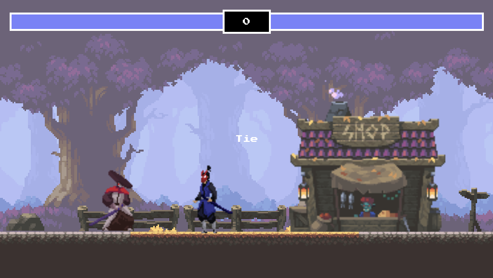

<h1>Code Review</h1>
  <h2>Overview</h2>
  <h3>Screenshot</h3>
  

  <h2>My process</h2>

  <h3>Built with</h3>
  <ul>
    <li>Semantic HTML5 markup</li>
    <li>CSS custom properties</li>
    <li>Flexbox</li>
    <li>CSS Grid</li>
  </ul>

  <h3>What I learned</h3>
  

  While working on this project, I had the opportunity to develop a fighting game prototype using JavaScript and HTML5 canvas. This experience helped me gain insights into various aspects of game development and programming techniques. Here are some of the key learnings from this project:

<ul>
  <li>Implemented game loop and animation rendering using the HTML5 canvas element, allowing for smooth and responsive visual updates.</li>
  <li>Utilized object-oriented programming principles to create modular and reusable code, making it easier to manage and maintain game entities.</li>
  <li>Applied collision detection algorithms to handle player interactions and determine hit detection between game characters.</li>
  <li>Explored sprite sheet animation techniques by slicing and rendering specific frames to create dynamic and lifelike character movements.</li>
  <li>Implemented keyboard event handling to capture user input and control player actions, enabling character movement, jumping, and attacking.</li>
</ul>

  Additionally, I learned about the importance of game balance and how to incorporate health and damage systems to create engaging gameplay. The code snippet below showcases a part of the game logic I developed for handling player attacks and collisions:

<pre>
  <code>
    // Example code snippet demonstrating player attack and collision handling
    if (player.isAttacking && player.framesCurrent === 4) {
      if (rectangularCollision({ rectangle1: player, rectangle2: enemy })) {
        enemy.takeHit();
        player.isAttacking = false;
      }
    }
  </code>
</pre>

  This project allowed me to deepen my understanding of JavaScript, HTML5 canvas, and game development concepts. It also highlighted the importance of planning, problem-solving, and iterating on game mechanics to create an enjoyable gaming experience.

  <h3>Useful resources</h3>

During the development of this project, I found the following resources helpful for learning and solving specific challenges:

<ul>
  <li>
    <a href="https://developer.mozilla.org/en-US/docs/Web/API/Canvas_API" target="_blank">MDN Web Docs - Canvas API</a> - This comprehensive guide from MDN helped me understand the Canvas API and its various features, such as rendering graphics, handling animations, and implementing collision detection.
  </li>
  <li>
    <a href="https://www.w3schools.com/js/default.asp" target="_blank">W3Schools JavaScript Tutorial</a> - As a beginner in JavaScript, W3Schools served as an excellent resource for understanding the fundamentals of the language and its syntax. It provided clear explanations and practical examples that helped me grasp the concepts used in the project.
  </li>
  <li>
    <a href="https://www.html5rocks.com/" target="_blank">HTML5 Rocks</a> - HTML5 Rocks is a fantastic resource for exploring the latest web technologies. I found their articles and tutorials on canvas-based game development insightful and inspiring, giving me valuable ideas and techniques to enhance my game.
  </li>
</ul>

These resources not only provided guidance on specific topics but also offered inspiration and a broader understanding of game development principles. I highly recommend exploring them if you're interested in diving deeper into canvas-based game development or JavaScript in general.

  <h2>Author</h2>
  <ul>
    <li>Website - <a href="https://www.brandonperry.dev">Brandon Perry</a></li>
    <li>Twitter - <a href="https://www.twitter.com/_basedperry">@_basedperry</a></li>
  </ul>
